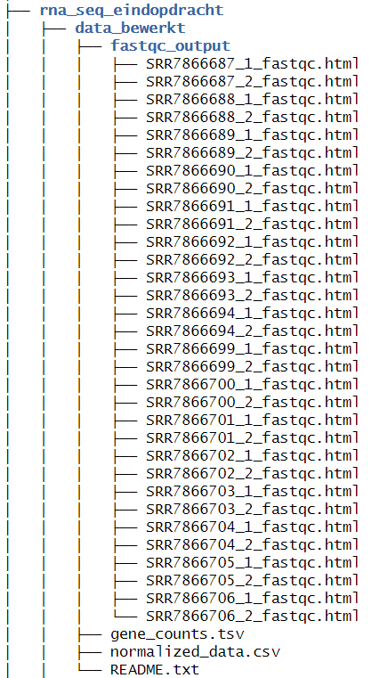

# Guerrilla Analytics on DAUR2 course

Guerrilla analytics is an approach to data management and analysis that focuses on efficiency, simplicity, and speed. It prioritizes creating practical workflows and making fast, effective choices with the available resources.

For my DAUR2 RNA sequencing and metagenomics assignments, I applied guerrilla analytics by reorganizing my project structure to optimize data management. I focused on keeping essential files well-organized, removed unnecessary large datasets, and provided clear documentation in readme.txt files. I visualized the folder structure using the {fs} package in R, as shown in the figure below, to make the project more organized and easier to navigate.

*Figure 2: Directory tree of the DAUR2 course.*
